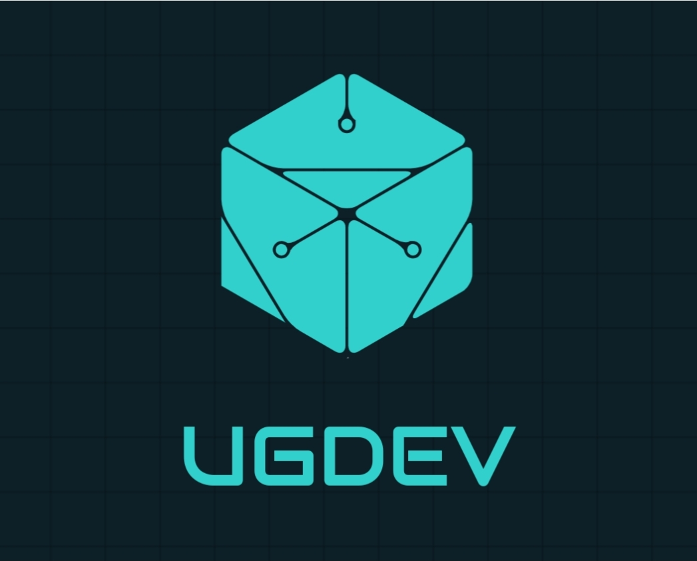

<p align="center">
	<h1 align="center">
		ug-garage
	</h1>
	<p align="center">
		
	</p>
	<h4 align="center">
		UgDev Discord Server (Support Server): &nbsp; <a href="https://discord.gg/9Tp8Mx5Kct" target="_blank"></img></a>
	</h4>
	<p align="center">
		<b>ug-garage</b> is a script that implements an advanced <b>Garage System</b> for your players on your FiveM server. The script implements different types of garages, including vehicles, boats, planes and others. We also have an impound system included for the law enforcement. You can also have different vehicles for your jobs.
	</p>
  <p align="center">
		<b>⚠️ This script has escrow enabled and it's not open-source. If you want it, you can purchase it by clicking <a href="https://ugdev.tebex.io/" target="_blank">here</a>. ⚠️</b>
	</p>
</p>

<br/>

## Features:
- Multi Framework (ESX OLD, ESX Legacy, QB-Core)
- Multi MySQL (oxmysq, mysql-async)
- Custom UI
- Impound System
- Custom Garages for Jobs

## Requirements:
- Must have a server with ESX, ESX Legacy or QB-Core
- Must have a server with mysql-async or oxmysql

## How to Install or Configure:
- https://docs.ugdev.cf/fivem/ug-garage/installation/
- https://docs.ugdev.cf/fivem/ug-garage/configuration/

## License
```
MIT License

Copyright (c) 2025 UgDev

Permission is hereby granted, free of charge, to any person obtaining a copy
of this software and associated documentation files (the "Software"), to deal
in the Software without restriction, including without limitation the rights
to use, copy, modify, merge, publish, distribute, sublicense, and/or sell
copies of the Software, and to permit persons to whom the Software is
furnished to do so, subject to the following conditions:

The above copyright notice and this permission notice shall be included in all
copies or substantial portions of the Software.

THE SOFTWARE IS PROVIDED "AS IS", WITHOUT WARRANTY OF ANY KIND, EXPRESS OR
IMPLIED, INCLUDING BUT NOT LIMITED TO THE WARRANTIES OF MERCHANTABILITY,
FITNESS FOR A PARTICULAR PURPOSE AND NONINFRINGEMENT. IN NO EVENT SHALL THE
AUTHORS OR COPYRIGHT HOLDERS BE LIABLE FOR ANY CLAIM, DAMAGES OR OTHER
LIABILITY, WHETHER IN AN ACTION OF CONTRACT, TORT OR OTHERWISE, ARISING FROM,
OUT OF OR IN CONNECTION WITH THE SOFTWARE OR THE USE OR OTHER DEALINGS IN THE
SOFTWARE.
```
